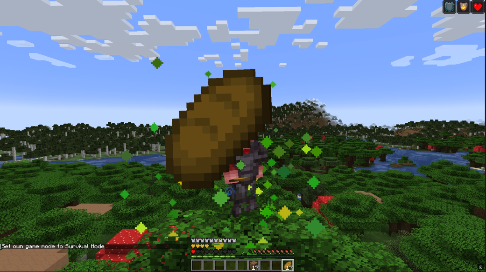
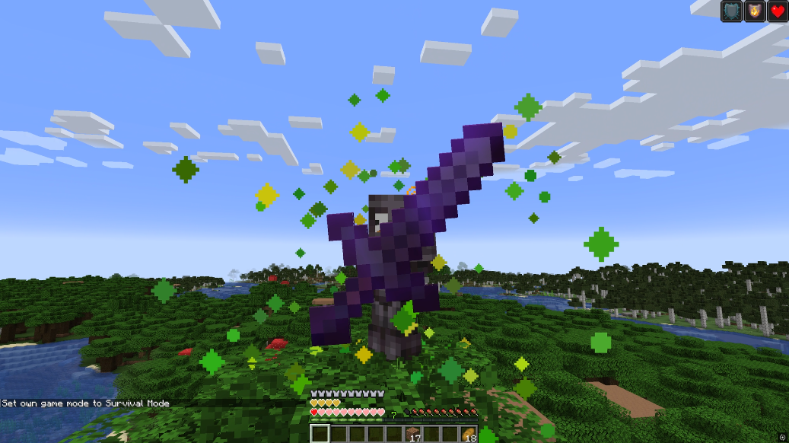
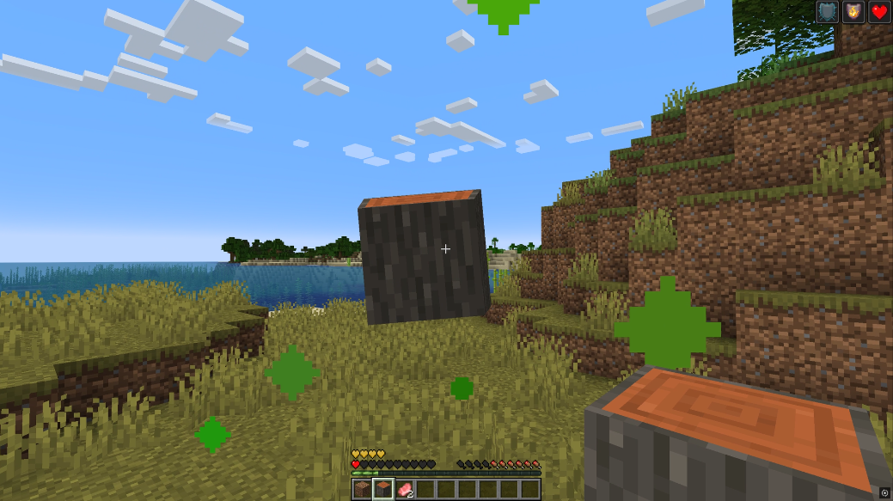

# AllTheTotems

This Fabric Mod enables the use of every item as a Totem of Undying.

Just hold any item in your hand when you're about to die, and it will act like a Totem of Undying.

Saving you, but then disappearing!

## Installing
Download it from [GitHub Releases](https://github.com/1TheCrazy/AllTheTotems/releases), [Modrinth](https://modrinth.com/mod/all-the-totems) or [CurseForge](https://www.curseforge.com/minecraft/mc-mods/all-the-totems)

Then place it inside your `mods` folder for Minecraft.

Make sure you have Fabric installed!

## Fabric API
Make sure to onclude the needed Fabric API.

You can find it on [GitHub](https://github.com/FabricMC/fabric), [CurseForge](https://www.curseforge.com/minecraft/mc-mods/fabric-api), or [Modrinth](https://modrinth.com/mod/fabric-api)

## Screenshots

